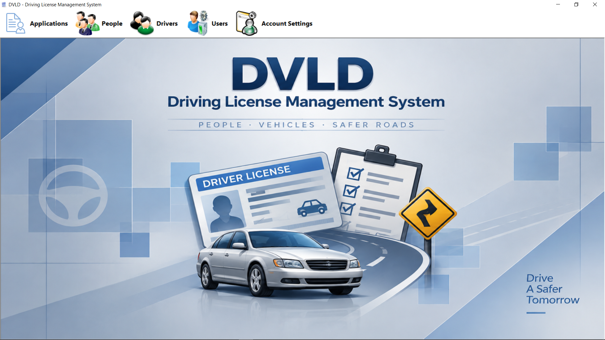
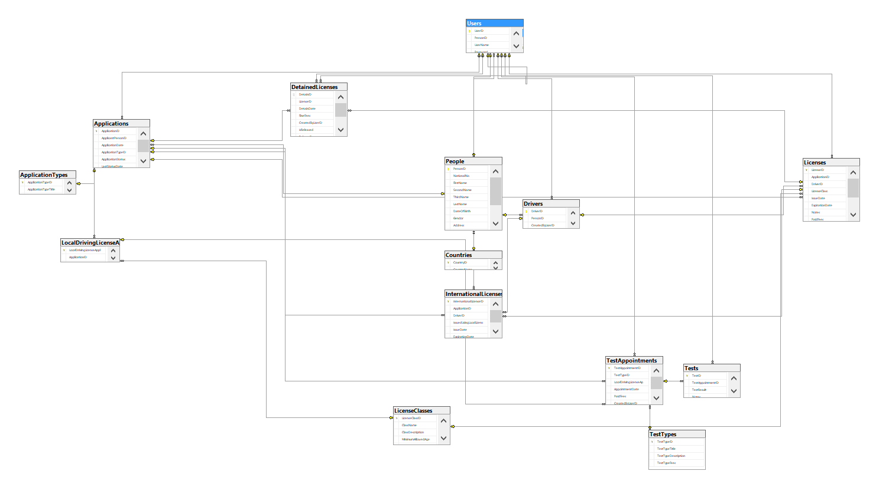
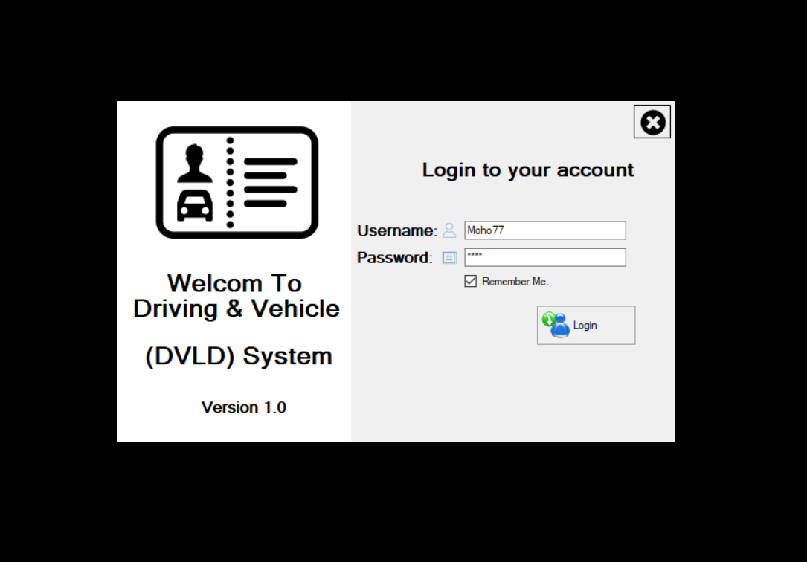
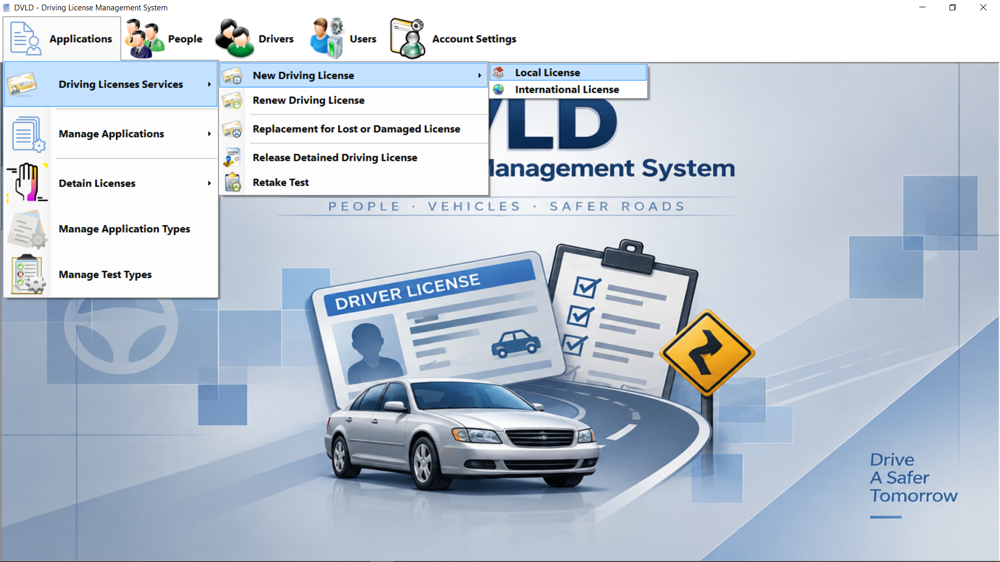
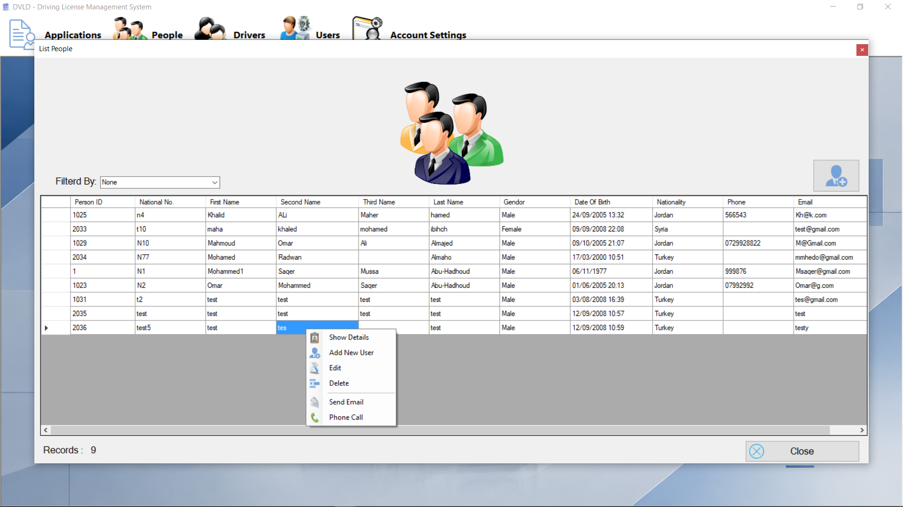
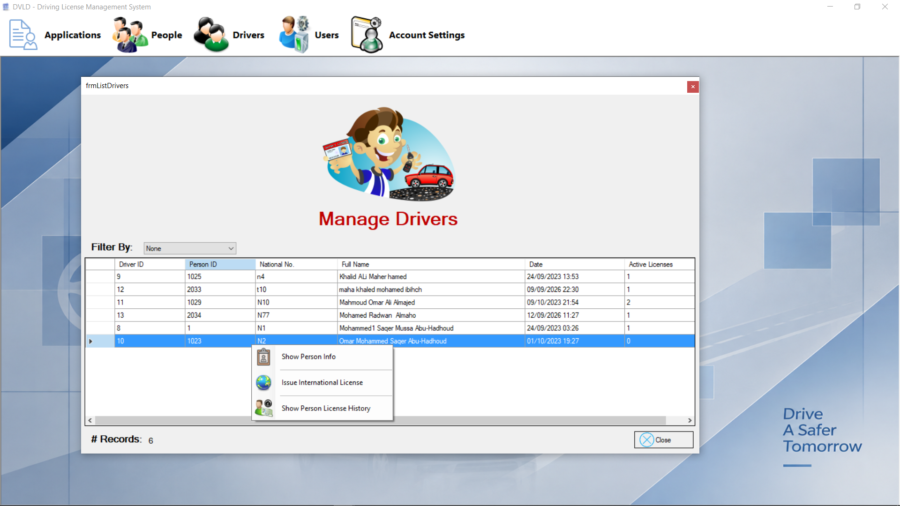
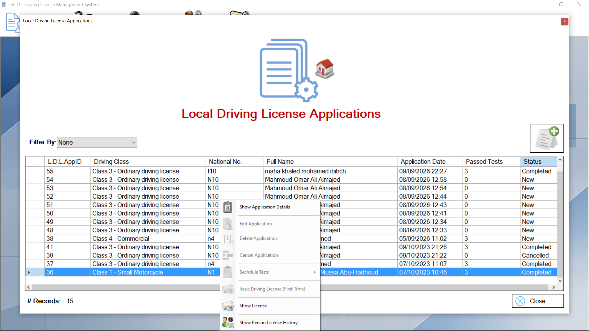
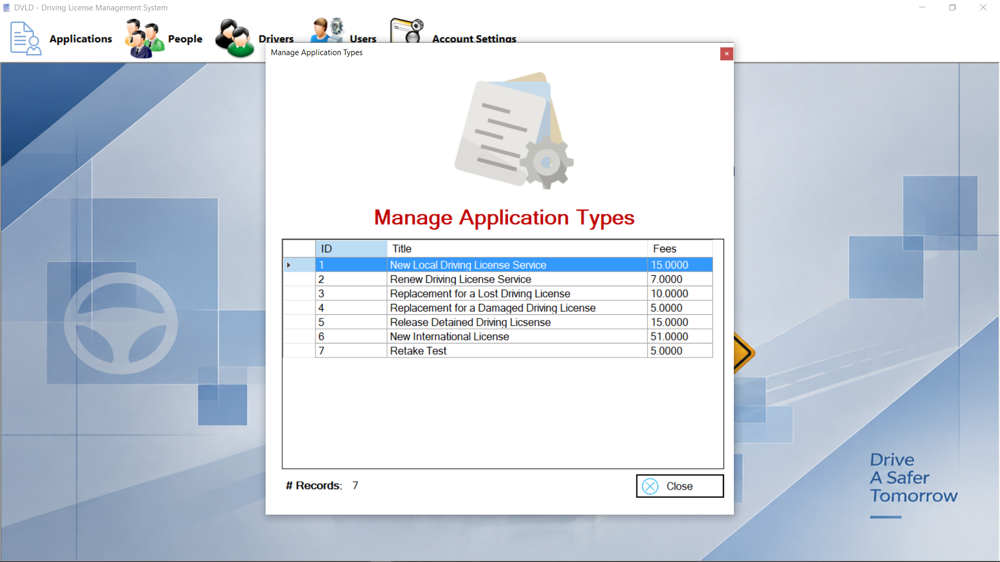
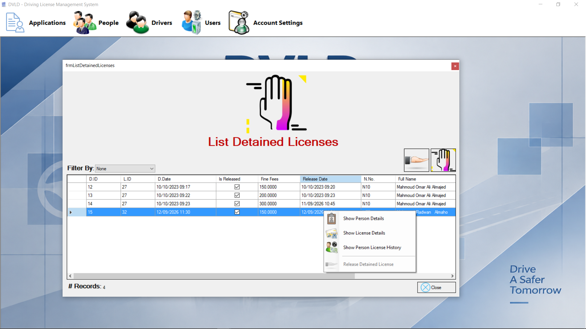

# DVLD - Driving & Vehicle License Department

[](https://learn.microsoft.com/dotnet/csharp/)
[](https://dotnet.microsoft.com/)
[](https://learn.microsoft.com/dotnet/desktop/winforms/)
[](https://www.microsoft.com/sql-server)
[](https://learn.microsoft.com/dotnet/framework/data/adonet/)
[](https://visualstudio.microsoft.com/)
[](https://git-scm.com/)
[](https://github.com/)

A desktop management application for the **Driving & Vehicle License Department (DVLD)**, developed using C# and Windows Forms.

The application provides a centralized system for managing people, users, drivers, driving license applications, tests, licenses, and related operations.



---

## Overview

DVLD is an educational desktop application that simulates the management of a Driving & Vehicle License Department.

The project was developed as a practical implementation of **Object-Oriented Programming**, **Three-Tier Architecture**, **ADO.NET**, and **SQL Server**.

The application separates the user interface, business logic, and database access into independent layers, keeping the responsibilities of each part of the system organized.

---

## Features

- People management
- User management and authentication
- Driver management
- Driving license applications
- Application type management
- Test management and test appointments
- Local and international license applications
- License management
- Detained license management
- Application and license tracking
- Remember Me functionality
- Password management
- Database-driven business operations

---

## Technologies

- C#
- .NET Framework
- Windows Forms
- ADO.NET
- Microsoft SQL Server
- T-SQL
- Visual Studio
- Git / GitHub

---

## Architecture

The application follows a **Three-Tier Architecture**:

```text
Presentation Layer
        ↓
Business Layer
        ↓
Data Access Layer
        ↓
SQL Server Database
```

### Presentation Layer

Contains the Windows Forms interface and handles user interaction, navigation, and UI-related validation.

### Business Layer

Contains the application's business objects and business logic.

### Data Access Layer

Handles communication with SQL Server using ADO.NET and performs database operations.

The Presentation Layer does not directly access the database. Database operations are handled through the Data Access Layer, while business rules are implemented in the Business Layer.

---

## Database

The application uses **Microsoft SQL Server** as its relational database.

The database contains the main entities required by the system, including:

- People
- Users
- Drivers
- Licenses
- License Classes
- Applications
- Application Types
- Tests
- Test Types
- Test Appointments
- Detained Licenses
- Countries

The `People` entity acts as the central entity for personal information, allowing the same person to be associated with different parts of the system without duplicating their personal data.

### Database Diagram



---

## Project Structure

```text
DVLD+Project+Final
│
├── DVLD
│   └── Presentation Layer
│
├── DVLD_Buisness
│   └── Business Layer
│
├── DVLD_DataAccess
│   └── Data Access Layer
│
├── Database
│   ├── DVLD_Database.bak
│   └── DVLD-Database-Diagram.png
│
├── ScreenShots
│   ├── ApplicationsMenue.png
│   ├── DeteinLicenseScreen.png
│   ├── Login.png
│   ├── MainScreen.png
│   ├── MangeApplicationsScreen.png
│   ├── MangeApplicationTypesSeccren.png
│   ├── MangeDriversScreen.png
│   ├── MangeInternalionalLicenseApplicationScreen.png
│   ├── MangePepoleScreen.png
│   └── MangeUserScreen.png
│
├── Assets
│
├── .gitignore
│
└── DVLD+Project+Final.slnx

---

## Getting Started

### Requirements

Before running the application, make sure the following are installed:

- Windows
- Visual Studio
- The .NET Framework version required by the project
- Microsoft SQL Server
- SQL Server Management Studio (SSMS)

---

## Database Setup

A SQL Server backup of the project database is included in the repository:

```text
Database/DVLD_Database.bak
```

### Restore the Database

1. Open **SQL Server Management Studio (SSMS)**.
2. Connect to your SQL Server instance.
3. Right-click **Databases**.
4. Select **Restore Database...**.
5. Select **Device** as the backup source.
6. Select the `DVLD_Database.bak` file from the repository.
7. Restore the database with the name:

```text
DVLD
```

After restoring the database, configure the application's connection string.

---

## Connection String Configuration

The application can connect to SQL Server using different authentication methods.

### 1. Windows Authentication

The current version of the project uses Windows Authentication:

```text
Server=.;Database=DVLD;Integrated Security=True;TrustServerCertificate=True;
```

With Windows Authentication, SQL Server uses the Windows account running the application to authenticate the connection. No SQL Server username or password is stored in the connection string.

If SQL Server is installed as a named instance, the server name can be changed accordingly. For example:

```text
Server=.\SQLEXPRESS;Database=DVLD;Integrated Security=True;TrustServerCertificate=True;
```

The exact server or instance name depends on the local SQL Server installation.

### 2. SQL Server Authentication

An alternative is SQL Server Authentication, where a SQL Server username and password are provided in the connection string.

For example:

```text
Server=.;Database=DVLD;User Id=YourUsername;Password=YourPassword;TrustServerCertificate=True;
```

In this configuration:

- `Server` specifies the SQL Server instance.
- `Database` specifies the database to connect to.
- `User Id` specifies the SQL Server login.
- `Password` specifies the password for that login.

The project previously used this type of connection string during development.

The current configuration uses **Windows Authentication**, so SQL Server credentials do not need to be stored directly in the application's connection string.

> When using SQL Server Authentication, replace the example credentials with the credentials configured on your own SQL Server instance.

> **Security:** Never commit real SQL Server usernames or passwords to the repository.

---

## Running the Application

After restoring the database and configuring the connection string:

1. Open the solution in Visual Studio:

```text
DVLD+Project+Final.slnx
```

2. Build the solution.
3. Set the Presentation project as the startup project if necessary.
4. Run the application.

The application will connect to the restored `DVLD` database using the configured connection string.

---

## Authentication

The application includes an application-level login system based on users stored in the database.

The login system supports:

- Username and password
- Remember Me
- Logout
- Password change
- Account settings

Detailed role-based authorization and user permissions are outside the current scope of the project.

---

## Screenshots

### Login



### Main Screen


### Applications Menu



### Manage People



### Manage Users


### Manage Drivers



### Manage Applications



### Manage Application Types



### International License Applications


### Detained Licenses



---

## Scope

This project is an educational implementation focused on applying software development concepts to a relatively complex desktop application.

The main focus is the implementation of:

- Object-Oriented Programming
- Three-Tier Architecture
- Relational Database Design
- ADO.NET database access
- Business logic
- Windows Forms development
- SQL Server database management

Advanced production-level concerns such as role-based authorization, automated testing, centralized configuration, and deployment infrastructure are outside the current scope of the project.

---

## Author

**Mohamad AlMoho**

GitHub:  
https://github.com/mmoho92-cloud